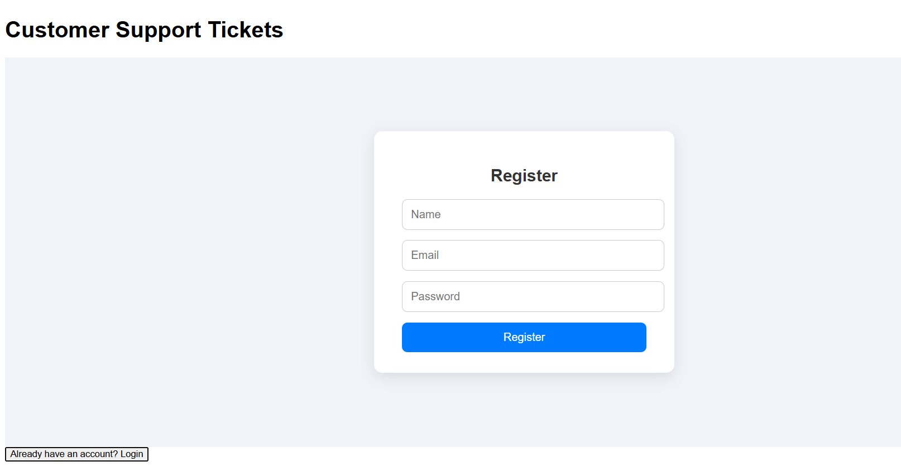
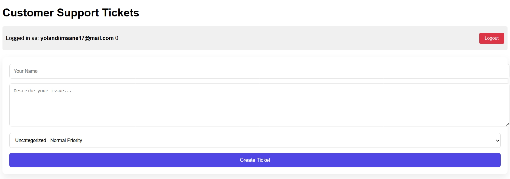
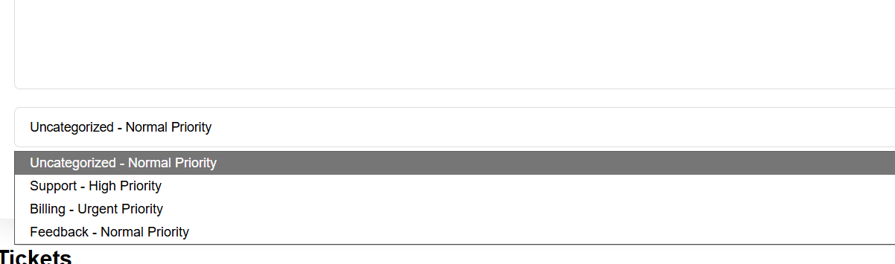

# Support Desk System

A full-stack customer support ticketing system that allows users to submit support requests and administrators to manage, prioritize, and resolve them through a centralized dashboard.

This project focuses on functionality, cbusiness logic, and role-based access, similar to real-world helpdesk systems.

## Frontend Features

### User Features

User registration and login: The users will login in to the system. First time users have the opportunity to create a new account and old users may use their previous login details to access the system.

Registration page for new users.

Submit support tickets: When the users logs in, they have the ability to create and submit tickets to the admin. The user gets to pick the ticket category, where the system dictacts wether it's a high priority ticket, low priority ticket, normal level ticket or an urgent one that needs to be attended first.

View previously submitted tickets after logging back in

