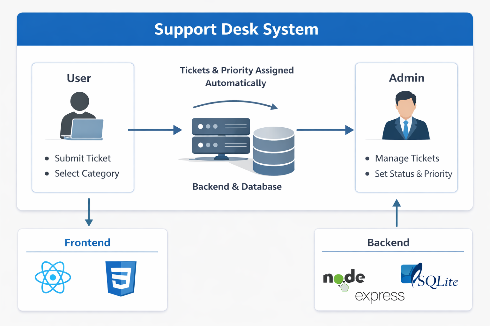
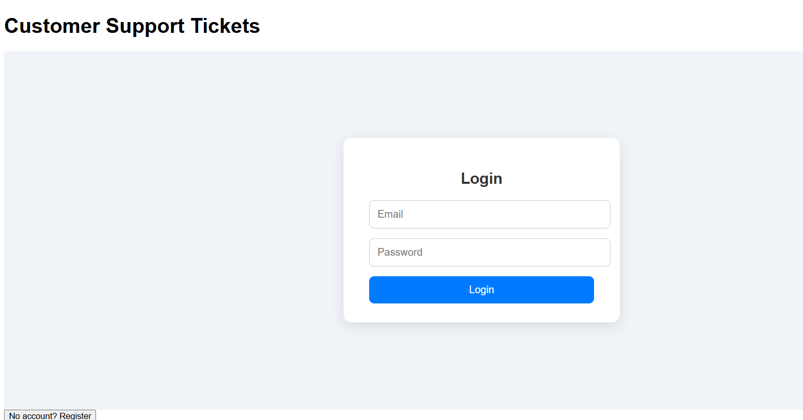

# Support Dest System

A full-stack customer support ticketing system that allows users to submit support requests and administrators to manage, prioritize, and resolve them through a centralized dashboard.

This project focuses on functionality, cbusiness logic, and role-based access, similar to real-world helpdesk systems.

## Frontend Features

### User Features

User registration and login: The users will login in to the system. First time users have the opportunity to create a new account and old users may use their previous login details to access the system.

Secure authentication

Submit support tickets

Choose a ticket category

View previously submitted tickets after logging back in

