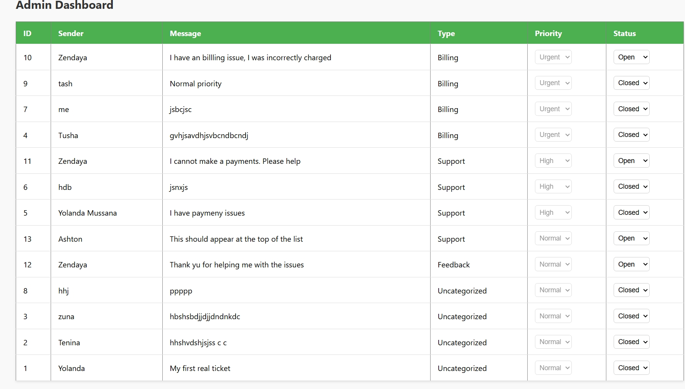
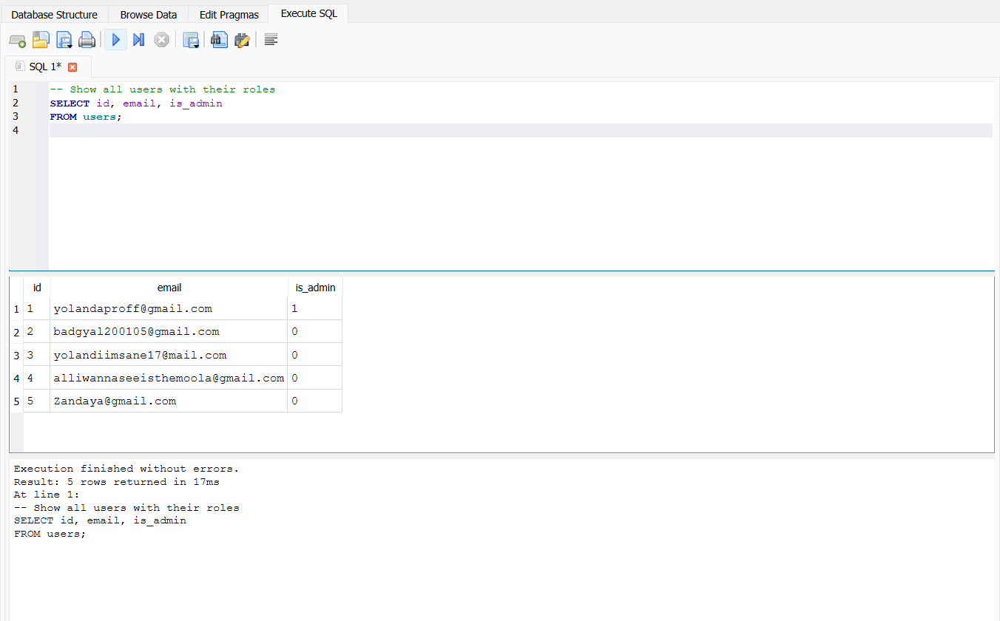
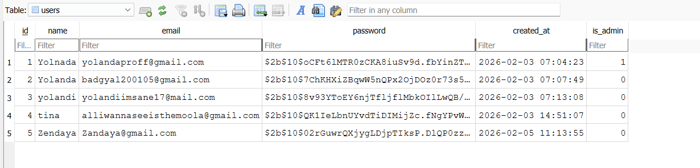
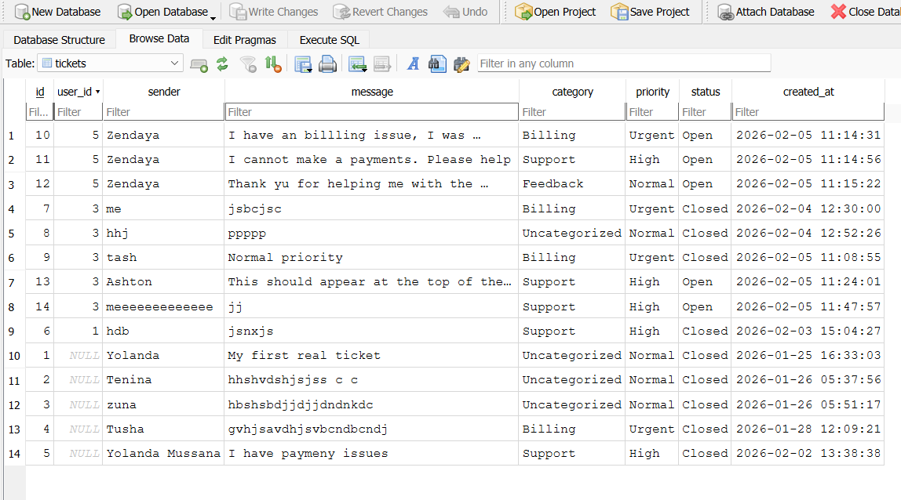

# Support Desk System


A full-stack customer support ticketing system that allows users to submit support requests and administrators to manage, prioritize, and resolve them through a centralized dashboard.

This project focuses on functionality, cbusiness logic, and role-based access, similar to real-world helpdesk systems.

## Frontend Features

### User Features

User registration and login: The users will login in to the system. First time users have the opportunity to create a new account and old users may use their previous login details to access the system.


Registration page for new users.


Submit support tickets: When the users logs in, they have the ability to create and submit tickets to the admin. The user gets to pick the ticket category, where the system dictacts wether it's a high priority ticket, low priority ticket, normal level ticket or an urgent one that needs to be attended first.


Tickets sorted according to their categories.


Users can view their previosuly submitted tickets and their status.


### Admin Features

Admin-only access: The Amit has excluse access to the admin dashboard. The Admin can view all the tickets sent but an individual user. Tickets are autmatically sorted by the backend in order of priority. All urgent tickets appear at the top, high priority tickets follow and normal priority are last. The admin can open and close user tickets after they have been sorted out.



## Business Logic 

Ticket priority is automatically assigned by the system, not by users or admins:

| Category | Priority| 
|----------|----------|
| Billing| Urgent| 
| Support| High| 
|Feedback| Normal|
|Uncategorized| Normal|

This ensures that there is consistent triage and that important issues don't get burried under less important issues.

## Tech Stack
Frontend: React, CSS, JavaScript
Backend: Node.js, Express, SQLite, CORS, bcrypt ( password hashing)


## Authentication & Roles

Users authenticate with email and password

Passwords are hashed before storage

Each user has a role:

user

admin

Admin privileges are enforced on the backend



## Backend (Database)

Two tables were created, one is named user and the other is named tickets.


The users table stores all users details and new users.


The tickets table stores all tickets requests and message per user.

### Backend Overview

The backend handles all the data, rules, and admin features so the frontend works smoothly.

#### **What It Does**

1. **Manages Users**

   * Keeps track of who is a normal user and who is an admin.
   * Secures passwords so no one can see them.
   * Makes sure users can only see and submit their own tickets.

2. **Manages Tickets**

   * Receives tickets from users.
   * Automatically decides how **urgent** a ticket is based on the category:

     * **Billing → Urgent**
     * **Support → High**
     * **Feedback & Uncategorized → Normal**
   * Sets all new tickets to **Open** status automatically.
   * Saves everything safely in the database.

3. **Admin Dashboard**

   * Shows all tickets to the admin in order of urgency (Urgent → High → Normal).
   * Lets the admin update ticket status or priority if needed.
   * Makes sure admins cannot bypass the system rules.

4. **Keeps Everything Secure**

   * Ensures users cannot see or edit other people’s tickets.
   * Enforces all rules on the backend, not on the frontend.
   * Keeps data accurate, safe, and consistent.


### **How Data Flows**

1. User submits a ticket →
2. Backend receives it →
3. Backend sets priority and status →
4. Ticket is saved in the database →
5. Admin dashboard fetches tickets in priority order →
6. Admin can update ticket status or priority →
7. Database is updated automatically


## Running the code locally

To run the backend locally, enter the following command.
```
cd backend
npm install
npm run dev
```
Server runs on ```http://localhost:5000```

To run the frontend locally, enter the following command.
```
cd frontend
npm install
npm start
```
Server runs on ```http://localhost:3000```

## Conclusion
The Support Desk System is a full-stack solution that makes customer support organized, fast, and reliable.

Users can easily submit tickets without worrying about priority or status.

The system automatically decides which issues are urgent, high, or normal.

Admins see all tickets in order of urgency, making it easy to focus on what matters most.

All data is secure, consistent, and properly managed behind the scenes.

This project demonstrates how a real-world helpdesk works, combining automation, security, and role-based management, while remaining simple and intuitive for both users and administrators.

---


